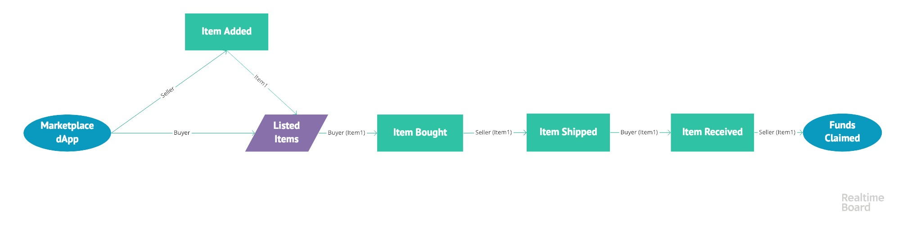

# Basic dApp Marketplace

## Introduction

This project is part of the assessment requirement of *2018DP Ethereum Developer Bootcamp*. It allows sellers to list their items, ship and claim funds (of their sold items in ether) and buyers to buy items by paying in ether and acknowledge on receiving the items.



## Pre-requisites

1. NodeJS (version 8.9.x)
2. Webpack
```
    npm install -g webpack
    npm install -g webpack-cli
```
3. Truffle
```
    npm install -g truffle
```
4. Ganache from [Truffle Website](!https://truffleframework.com/ganache)

## How to run manually (macOS)

1. Open a terminal, *run `ganache-cli` and keep it running*
2. Open another (2nd) terminal and run the following:
```
    $ git clone  
    $ cd final-project-wakqasahmed
```

3. To interact with smart contract from CLI:
```
    $ truffle compile --reset
    $ truffle migrate --reset
    $ truffle test
```

OR

```
    truffle develop
    develop> compile --reset
    develop> migrate --reset
    develop> test
```

4. To access the dApp UI, run the following:
```
npm install
npm start
```

## How to run (Docker)

1. Build the docker container.
    ```
    docker build -t dappmarketplace .
    ```

1. Launch the docker container.
    ```
    docker run -p 3000:3000 dappmarketplace:latest
    ```

1. Browse to http://localhost:3000

## FAQ

* __Why is there both a truffle.js file and a truffle-config.js file?__

    Truffle requires the truffle.js file be named truffle-config on Windows machines. Feel free to delete the file that doesn't correspond to your platform.
